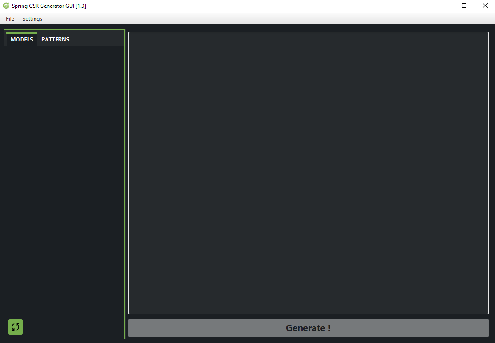
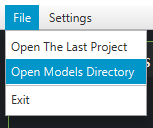
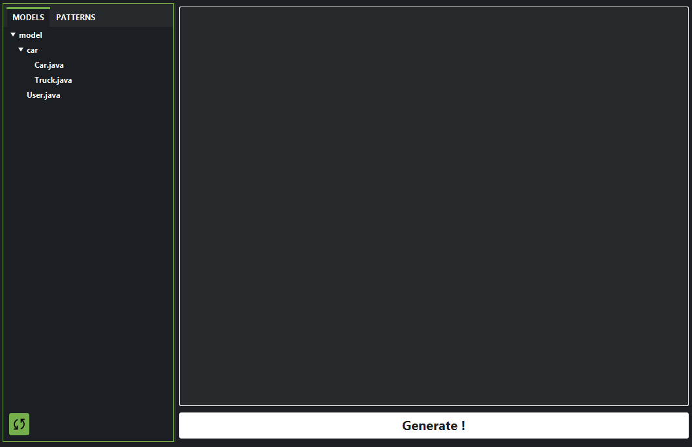
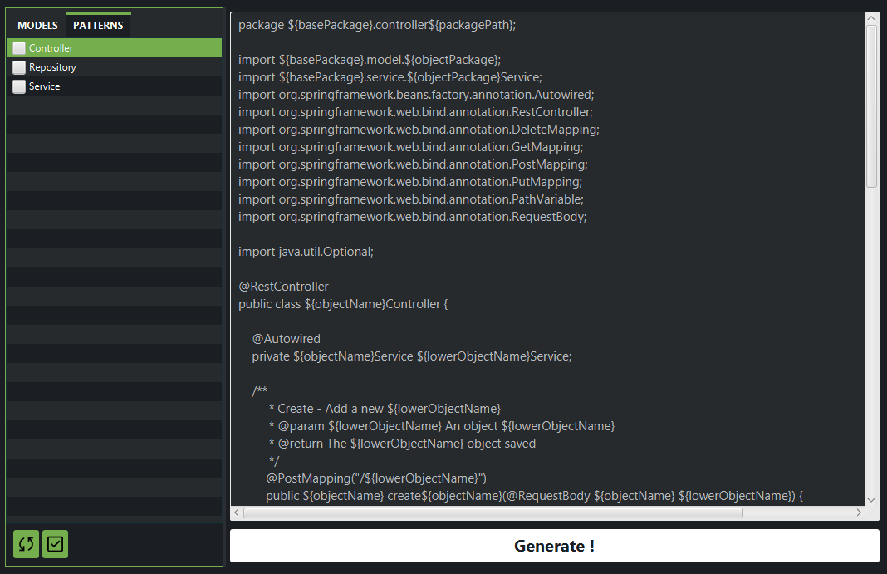
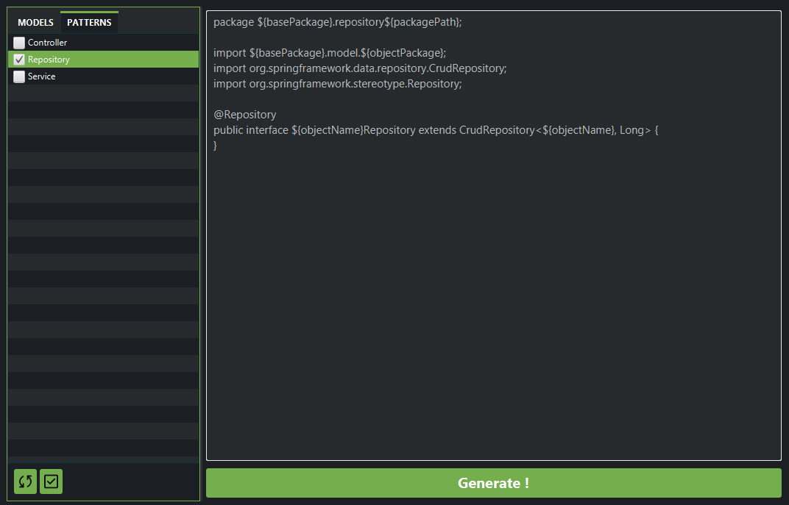
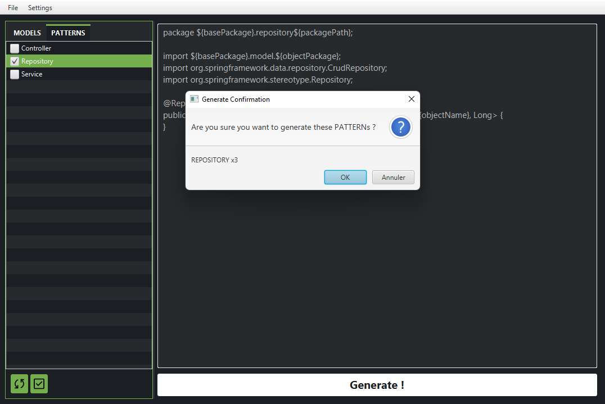
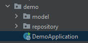

# Spring-CSR-Generator-GUI (MANUAL)

1. Open **Spring-CSR-Generator-GUI** click on .jar file or execute the following command : 
    ```
   java -jar Spring_CSR_Generator_GUI.jar
   ```



2. Open your model package from your project `File` > `Open Models Directory`.




You can see that the "Generate !" button is now enable !

3. In **PATTERNS** tab, you can see the patterns list, by default there are 3 patterns Controller, Service and Repository (CSR).



*You can create your own pattern and move it in **pattern** directory to add it in the list*

4. Select patterns you want to generate from your models



5. Then, click on "Generate !", after some seconds check your project 




## Some Helps

1. Your project should be respected this package configuration :
```
|-src
    |-...
        |-model/
            |-.../
            |-...
        |-MainClass.java
|-...
```

2. Create your own patterns via another IDE (IntelliJ, Eclipse, VSCode,...) and then move them in **pattern** directory.
